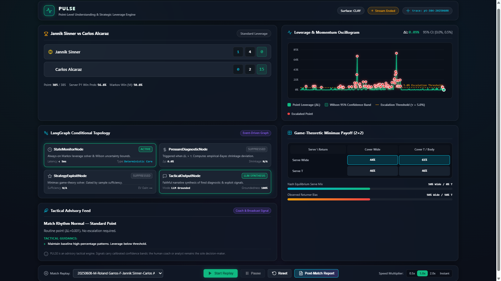

# PULSE — Point-Level Understanding & Strategic Leverage Engine

<div align="center">

[](https://www.python.org/)
[](https://github.com/astral-sh/uv)
[](https://fastapi.tiangolo.com/)
[](https://langchain-ai.github.io/langgraph/)
[](https://www.docker.com/)
[](reports/docs/evaluations/test_suite_report.md)
[](reports/docs/evaluations/test_suite_report.md)
[](LICENSE.txt)

<br/>

**A mathematically exact, event-driven tactical intelligence system for professional tennis.**  
Monitors match leverage point-by-point via a closed-form Markov solver, conditionally triggers empirical-Bayes pressure diagnostics and game-theoretic minimax exploit recommendations, and delivers live tactical signals through a glassmorphic browser cockpit and streaming API.

<br/>

[🚀 Quickstart](#quickstart) • [📊 Architecture](#overview) • [🖥️ Tactical Cockpit](#cockpit) • [📈 Evaluation Metrics](#metrics) • [🎾 Mathematical Elegance](tennis_mathematical_elegance.md) • [📋 Project Charter](reports/docs/references/pulse_project_charter.md) • [📑 Final Evaluation Report](reports/docs/evaluations/phase7_final_evaluation_report.md)

</div>

---

<a id="overview"></a>

## 🌟 Overview & System Architecture

PULSE inverts the traditional AI paradigm:

> **"Deterministic math is the ground truth; the agent is a thin layer on top of it."**

Rather than approximating match context with opaque black-box LLMs, PULSE computes **exact combinatorial win probabilities** and **derivatives ($\Delta \text{Leverage}$)** directly from the tennis score state. Machine learning and game theory fire conditionally only when the score dynamics and sample sizes statistically justify tactical escalation.

```text
          Point Score State (e.g. 30-40, Set 2, Game 4-4)
                                 │
                                 ▼
                 Exact Closed-Form Markov Solver
               (Win Probability & Point Leverage ΔL)
                                 │
                                 ▼
                     StateMonitorNode (Always-on)
             Evaluates ΔL vs Configured Escalation Threshold
                                 │
                 ┌───────────────┴───────────────┐
                 │ ΔL < 0.10                     │ ΔL ≥ 0.10
                 ▼                               ▼
          Routine Point               High-Leverage Escalation
       (Zero Diagnostic Cost)                    │
                                ┌────────────────┴────────────────┐
                                ▼                                 ▼
                    PressureDiagnosticNode               StrategyExploitNode
                  (Empirical-Bayes Shrinkage)          (Minimax Nash Equilibrium)
                  Evaluates Clutch Performance           Exploits Returner Bias
                  Across Leverage Tiers (N ≥ 10)       Gated by Sample Size (N ≥ 30)
                                └────────────────┬────────────────┘
                                                 ▼
                                         TacticalOutputNode
                               (Assembles Pre-Computed Signals;
                                LLM Narrative with Pure Passthrough Fallback)
                                                 │
                                                 ▼
                          FastAPI Real-Time SSE Stream & UI Cockpit
```

---

<a id="status"></a>

## 🚦 Project Status — v1.0.0 (Complete & Validated)

All 7 development phases, verification gates, and Definition-of-Done (DoD) criteria are fully implemented, tested, and signed off.

| Phase                       | Core Deliverables                                                                 | Verified Metrics & Status                                      |     Status      |
| :-------------------------- | :-------------------------------------------------------------------------------- | :------------------------------------------------------------- | :-------------: |
| **Phase 0 — Planning**      | ML Canvas, Project Charter, PRD, Technical Roadmap, System Design                 | 13 Architectural Decision Records approved                     | ✅ **Complete** |
| **Phase 1 — Scaffolding**   | `uv` toolchain, `params.yaml`, line-ceiling gate (<1000 lines), custom exceptions | Standardized logging & zero-hardcoded thresholds               | ✅ **Complete** |
| **Phase 2 — Core Math**     | Pydantic v2 `PointRecord`, DVC ingestion, Closed-form Markov solver               | **Deviation $< 10^{-9}$** vs combinatorial theory              | ✅ **Complete** |
| **Phase 3 — Tier 1 ML**     | Point-win classifier & pressure deviation empirical-Bayes shrinkage model         | **ROC-AUC = 0.669**, 90% Credible Coverage = 93.8%             | ✅ **Complete** |
| **Phase 4 — Orchestration** | LangGraph conditional graph, DeepEval groundedness checks                         | Zero-hallucination numbers synthesis & fallback                | ✅ **Complete** |
| **Phase 5 — Game Theory**   | Minimax Nash equilibrium solver, best-response exploit, Beta priors               | 2,139 matrix strata, sample-size gated ($N \ge 30$)            | ✅ **Complete** |
| **Phase 6 — Streaming API** | FastAPI SSE/WS stream, real-time replay simulator, SQLite audit (FR-12)           | Sub-millisecond in-process streaming latency                   | ✅ **Complete** |
| **Phase 6.5 — Cockpit UI**  | Embedded single-page Tactical Cockpit (HTML5/CSS3/Canvas 2D, zero CDN)            | HTTP 200 in 4.2ms; zero external build tools                   | ✅ **Complete** |
| **Phase 6.6 — Analytics**   | Post-match aggregation, pivotal points, pressure tiers, game-theory audit         | Markdown/JSON exports, Groq/Anthropic debrief                  | ✅ **Complete** |
| **Phase 7 — Production**    | Multi-stage Docker, GitHub Actions CI, Trivy scan, precision evaluation           | **Precision = 96.02%**, **False Alert = 3.98%**, **202 Tests** | ✅ **Complete** |

---

<a id="invariants"></a>

## 🔑 Foundational Invariants

PULSE is governed by four constitutional principles:

> [!IMPORTANT]
>
> 1. **Ground-Truth Primacy:** The closed-form Markov solver is the ground truth. It is never approximated, learned, or replaced by a neural network. A deviation $> 10^{-9}$ from combinatorial probability theory is a CI-blocking build failure.
> 2. **The Sufficiency Gate:** PULSE never emits a confident signal without statistical backing. If opponent observation count is below threshold ($N < 30$), the exploit module suppresses its badge and reports `"insufficient_data"`.
> 3. **Advisory-Only Mandate:** PULSE produces tactical intelligence for coaches, analysts, and broadcasters. It never executes automated decisions.
> 4. **Conditional Graph Topology:** Downstream diagnostic and exploit nodes fire only when match leverage and score context justify execution, conserving compute and preventing alert fatigue.

---

<a id="metrics"></a>

## 📊 Key Evaluation & Operational Metrics

| Evaluation Metric                      | Charter Target (PRD §7) |                 Measured System Outcome                 |                                     Verification Authority                                      |
| :------------------------------------- | :---------------------: | :-----------------------------------------------------: | :---------------------------------------------------------------------------------------------: |
| **Alert Precision (Retrospective)**    |      $\ge 75.0\%$       |              **96.02%** (917 / 955 alerts)              |   [`escalation_precision_report.md`](reports/docs/evaluations/escalation_precision_report.md)   |
| **False Escalation Rate**              |       $< 15.0\%$        |               **3.98%** (38 / 955 alerts)               |   [`escalation_precision_report.md`](reports/docs/evaluations/escalation_precision_report.md)   |
| **Alert Trigger Rate**                 |    $5.0\% - 15.0\%$     |            **6.93%** of all points (Optimal)            |                             100 historical matches (13,790 points)                              |
| **Realized Swing Impact Ratio**        |     $> 5.0\text{x}$     |      **11.0x** (8.74% on alerts vs 0.79% routine)       |                                   Historical match evaluation                                   |
| **StateMonitor Latency SLA**           |   $< 1,000\text{ms}$    |            **32.5ms average** (P95: 132.9ms)            | [`shadow_mode_acceptance_report.md`](reports/docs/evaluations/shadow_mode_acceptance_report.md) |
| **Post-Match Report Latency**          |   $< 2,000\text{ms}$    | **819.6ms** (w/ live LLM debrief), $< 5\text{ms}$ cache |                                    Held-out acceptance suite                                    |
| **Test Suite Pass Rate**               |         $100\%$         |      **202 / 202 passed** (0 failures, 0 warnings)      |             [`test_suite_report.md`](reports/docs/evaluations/test_suite_report.md)             |
| **Code Coverage**                      |       $\ge 70\%$        |    **92% line coverage** (2,090 / 2,260 statements)     |                                   Pytest coverage gate in CI                                    |
| **Container Security Vulnerabilities** |       0 Critical        |              **0 High / 0 Critical CVEs**               |                                 Aqua Security Trivy scan in CI                                  |

---

<a id="cockpit"></a>

## 🖥️ Tactical Cockpit (Interactive Presentation Layer)

PULSE includes a zero-dependency, dark-mode glassmorphic single-page dashboard embedded natively within FastAPI (`src/api/static/`).

<p align="center">
  
</p>

- **Live Momentum & Leverage Curve:** Real-time 2D Canvas chart rendering calculated point leverage alongside Wilson 95% confidence intervals.
- **Node Execution Status Badges:** Live visual indicators showing whether `StateMonitor`, `PressureDiagnostic`, `StrategyExploit`, and `TacticalOutput` nodes fired or were suppressed.
- **Interactive Match Replay Controls:** Play, pause, step, and playback speed multipliers ($1\times, 2\times, 5\times, 10\times, \text{Instant}$).
- **Game-Theoretic Minimax Matrix:** Displays realized serve direction distribution against game-theoretic Nash equilibrium ($x^*$) and returner anticipation bias ($\hat{y}$).
- **Comprehensive Post-Match Modal:** Instant post-match tactical debrief with pivotal point timelines, leverage-tier pressure resilience breakdown, and one-click Markdown/JSON/print PDF export tools.

---

<a id="stack"></a>

## 🛠️ Stack & Technologies

```text
Runtime & Language:       Python 3.11+ (Strict typing with Pyright)
Package Management:       uv (Astral) with frozen lockfile reproducibility
Deterministic Core:       NumPy, SciPy (scipy.optimize.linprog HiGHS LP Solver)
Machine Learning:         scikit-learn, Empirical-Bayes Beta-Binomial Shrinkage
Agent Orchestration:      LangGraph (Conditional Event-Driven StateGraph)
LLM Narrative Debrief:    Groq Cloud (llama-3.1-8b-instant), Anthropic (Claude 3.5 Haiku)
Streaming Transport:      FastAPI, Server-Sent Events (SSE), WebSockets, aiosqlite
Observability & Logging:  OpenTelemetry distributed child spans, structlog JSON logs
Pipeline & Versioning:    DVC (Data Version Control), Parquet
Containerization:         Docker (Multi-stage non-root digest-pinned), Docker Compose
Quality & CI/CD:          GitHub Actions, Ruff, Pyright, DeepEval, Trivy Container Scanner
```

---

<a id="quickstart"></a>

## 🚀 Quickstart & Execution

### Option 1: One-Click Local Launcher (Windows)

```cmd
.\launch_app.bat
```

_Automatically synchronizes the `uv` virtual environment, validates ML models and dataset artifacts, boots the FastAPI engine, and opens the Tactical Cockpit at `http://localhost:8000/` in your default browser._

### Option 2: Production Containerization (Docker Compose)

```bash
# Launch full-stack containerized service with SQLite persistence
docker compose up --build

# Open the Tactical Cockpit in your browser
open http://localhost:8000/
```

### Option 3: Manual Step-by-Step Setup

```bash
# 1. Clone repository & install dependencies
git clone https://github.com/SebastianGarrido2790/PULSE.git
cd PULSE
uv sync

# 2. Reproduce full DVC data and ML training pipeline
uv run dvc repro

# 3. Launch FastAPI streaming server
uv run python -m src.api.main

# 4. In a separate terminal, replay a match via CLI
uv run python -m src.simulator.replay --match-id 20200103-M-ATP_Cup-RR-Alex_De_Minaur-Alexander_Zverev --speed 2.0
```

---

<a id="verification"></a>

## 🧪 Verification & Quality Commands

| Verification Goal                 | Command                                                  | Description                                                 |
| :-------------------------------- | :------------------------------------------------------- | :---------------------------------------------------------- |
| **Run Full Test Suite**           | `uv run pytest`                                          | Executes 202 unit, integration, and groundedness eval tests |
| **Run Solver Correctness Gate**   | `uv run pytest tests/unit/test_markov_solver.py`         | Validates $< 10^{-9}$ deviation from combinatorial theory   |
| **Run Code Coverage Analysis**    | `uv run pytest --cov=src --cov-report=term-missing`      | Validates $\ge 70\%$ coverage policy (measured 92%)         |
| **Run Static Type Checker**       | `uv run pyright`                                         | Strict static type validation with 0 allowable errors       |
| **Run Linter & Formatter Checks** | `uv run ruff check . && uv run ruff format --check .`    | Fast import sorting and 100-character line compliance       |
| **Run File-Size Ceiling Gate**    | `python scripts/check_file_size.py`                      | Enforces 1,000-line modularity limit per file under `src/`  |
| **Run Precision Evaluation**      | `uv run python scripts/evaluate_escalation_precision.py` | Evaluates alert precision across 100 historical matches     |
| **Run Shadow-Mode Acceptance**    | `uv run python scripts/run_shadow_mode_acceptance.py`    | Replays held-out matches against containerized stack        |

---

<a id="structure"></a>

## 📂 Repository Structure

```text
PULSE/
├── src/
│   ├── analytics/        # Post-match leverage summaries, pivotal point extraction & debriefs
│   ├── api/              # FastAPI streaming service, REST routes, schemas & static UI
│   │   ├── static/       # Zero-dependency glassmorphic Tactical Cockpit SPA (HTML/CSS/JS)
│   │   ├── main.py       # FastAPI application lifecycle & startup handlers
│   │   ├── schemas.py    # Pydantic v2 request/response wire contracts
│   │   └── streaming.py  # SSE & WebSocket real-time point streaming endpoints
│   ├── config/           # Centralized configuration loader (params.yaml)
│   ├── core/             # Closed-form Markov solver, minimax game theory & Wilson intervals
│   ├── graph/            # LangGraph conditional graph nodes & state definitions
│   ├── models/           # Point-win classifier & empirical-Bayes pressure shrinkage
│   ├── schemas/          # Domain scoring models & PointRecord data contracts
│   ├── simulator/        # Real-time historical match replay event generator
│   └── utils/            # Structured JSON logger, custom exceptions & SQLite persistence
├── scripts/              # CI ceiling checks, DVC matrix builder & acceptance runners
├── tests/                # Unit tests, integration suites & DeepEval groundedness checks
├── reports/
│   ├── docs/             # PRD, Project Charter, ML Canvas, System Design ADRs & Workflows
│   └── figures/          # Tactical Cockpit UI screenshots and architecture graphics
├── Dockerfile            # Multi-stage non-root digest-pinned production container
├── docker-compose.yml    # Full-stack container orchestration with persistent SQLite volume
├── dvc.yaml              # Reproducible data and model training pipeline DAG
├── params.yaml           # Centralized operational thresholds (zero magic numbers)
└── pyproject.toml        # Project dependencies, Ruff, Pyright, and Pytest configuration
```

---

<a id="docs"></a>

## 📜 Documentation & Reference Hub

- 📘 **[Mathematical Foundations of Tennis Leverage](tennis_mathematical_elegance.md)**
- 📋 **[PULSE Project Charter & Definition of Done](reports/docs/references/pulse_project_charter.md)**
- 📐 **[Machine Learning Canvas](reports/docs/references/pulse_ml_canvas.md)**
- 🏗️ **[System Design & Architectural Decision Records (ADRs)](reports/docs/architecture/system_design.md)**
- 📑 **[Phase 7 Final Evaluation Report & DoD Reconciliation](reports/docs/evaluations/phase7_final_evaluation_report.md)**
- 🧪 **[Comprehensive Test Suite & Quality Report](reports/docs/evaluations/test_suite_report.md)**
- 🗺️ **[Technical Roadmap (Phases 0–7 Complete)](reports/docs/references/technical_roadmap.md)**

---

<a id="license"></a>

## 📄 License & Attribution

- **Software License:** Distributed under the **MIT License**. See [LICENSE.txt](LICENSE.txt) for full terms.
- **Data Attribution:** Public tennis charting data sourced from [The Match Charting Project](https://github.com/JeffSackmann/tennis_MatchChartingProject) by Jeff Sackmann, licensed under [CC BY-NC-SA 4.0](https://creativecommons.org/licenses/by-nc-sa/4.0/).
