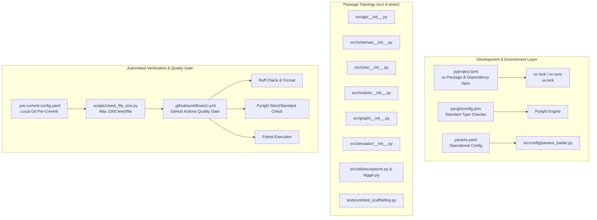

# Phase 1 — Project Scaffolding: Architectural Report

**Product:** PULSE (Point-Level Understanding & Strategic Leverage Engine)  
**Phase:** Phase 1 — Project Scaffolding  
**Document Type:** Architecture — The What  
**Authority:** [`phase1_scaffolding_decisions.md`](../decisions/phase1_scaffolding_decisions.md), [`technical_roadmap.md`](../references/technical_roadmap.md), [`system_design.md`](./system_design.md) (ADR-007)  
**Status:** Implemented ✅ | 100% Package Hierarchy & Toolchain Verified | CI-Blocking Verification Passed  
**Last Updated:** 2026-08-11

---

## 0. Purpose & Scope

This document provides a detailed technical breakdown of **what Phase 1 built, how every scaffolding component functions, and the architectural principles governing the production skeleton and toolchain of PULSE.**

Phase 1 establishes the production infrastructure foundation. Before any mathematical solver is compiled or any machine learning model is trained, PULSE requires a strict, deterministic, type-safe development environment with automated quality enforcement, standardized package boundaries, and continuous integration pipeline controls.

### 0.1 Deliverable Index

| Deliverable | Source File / Artifact | Primary Responsibility | Status |
| :--- | :--- | :--- | :--- |
| **Package Dependency Specification** | [`pyproject.toml`](../../../pyproject.toml) | `uv` package metadata, production/dev dependencies, Ruff & Pytest settings | ✅ Complete |
| **Static Type Configuration** | [`pyrightconfig.json`](../../../pyrightconfig.json) | Repo-root Pyright configuration targeting Python 3.11 (`standard` mode) | ✅ Complete |
| **Configuration Contract** | [`params.yaml`](../../../params.yaml) | Centralized, namespaced threshold parameters (`thresholds`, `latency`, `models`, `ci`) | ✅ Complete |
| **Pipeline Skeleton** | [`dvc.yaml`](../../../dvc.yaml) | Stage definitions (`ingest`, `train_classifier`, `train_pressure`, `evaluate`) with `echo` stubs | ✅ Complete |
| **File-Size Ceiling Checker** | [`scripts/check_file_size.py`](../../../scripts/check_file_size.py) | 1,000-line hard ceiling enforcement per `src/` file (§5.1 of project constitution) | ✅ Complete |
| **Pre-Commit Hook Suite** | [`.pre-commit-config.yaml`](../../../.pre-commit-config.yaml) | Local git hooks for ruff, ruff-format, check-yaml, private-key detection, file ceiling | ✅ Complete |
| **CI Quality Gate Workflow** | [`.github/workflows/ci.yml`](../../../.github/workflows/ci.yml) | GitHub Actions single-job sequential pipeline (`setup-uv`, ruff, pyright, ceiling, pytest) | ✅ Complete |
| **Core Utilities & Exceptions** | [`src/utils/exceptions.py`](../../../src/utils/exceptions.py), [`src/utils/logger.py`](../../../src/utils/logger.py) | Custom exception hierarchy and structured logging with `Path` resolution | ✅ Complete |
| **Package Hierarchy Stubs** | [`src/*/__init__.py`](../../../src/), [`tests/*/__init__.py`](../../../tests/) | Docstring-only `__init__.py` files across all package subdirectories | ✅ Complete |
| **Scaffolding Unit Test** | [`tests/unit/test_scaffolding.py`](../../../tests/unit/test_scaffolding.py) | Baseline pytest checking existence of core infrastructure files | ✅ Complete |

---

## 1. System Architecture & Topology Overview

### 1.1 In-Process Scaffolding & Toolchain Topology

PULSE enforces in-process modularity: all packages run in-process within the Python runtime. Scaffolding is designed to guarantee zero circular dependencies and immediate feedback on quality gate failures.



---

## 2. Directory Structure & Modular Design

The repository layout strictly adheres to project constitution §4. Every module has a single, well-defined responsibility:

```text
PULSE/
├── .github/
│   └── workflows/
│       └── ci.yml             # Single-job sequential GitHub Actions CI workflow
├── .env.example                # Template for local environment variables
├── .gitignore                  # Git exclusion rules (includes .agents/ & ignores legacy RAG)
├── .pre-commit-config.yaml     # Pre-commit hook definitions
├── dvc.yaml                    # DVC pipeline stage definitions
├── params.yaml                 # Centralized configuration schema & operational thresholds
├── pyproject.toml              # Build backend, dependencies (uv), Ruff & Pytest settings
├── pyrightconfig.json          # Pyright type checker settings
├── README.md                   # System documentation & project status overview
├── scripts/
│   └── check_file_size.py      # 1,000-line ceiling enforcement script
├── src/
│   ├── __init__.py
│   ├── py.typed                # PEP 561 marker for inline type annotations
│   ├── api/                    # FastAPI endpoints & streaming (Phase 6)
│   ├── config/                 # Strongly typed params.yaml loaders
│   ├── core/                   # Deterministic Markov solver & game theory (Phase 2 & 5)
│   ├── graph/                  # LangGraph conditional orchestration nodes (Phase 4)
│   ├── models/                 # Tier 1 ML models (Phase 3)
│   ├── schemas/                # Pydantic v2 & Pandera row schemas (Phase 2)
│   ├── simulator/              # Match replay engine (Phase 6)
│   └── utils/                  # Exceptions, logger, prompt sanitization
└── tests/
    ├── __init__.py
    ├── evals/                  # DeepEval groundedness checks (Phase 6)
    ├── integration/            # LangGraph integration tests (Phase 4)
    └── unit/                   # Scaffolding & analytical core unit tests
```

---

## 3. Toolchain & Quality Enforcement Architecture

### 3.1 Package Management via `uv`

Dependency resolution is strictly managed by `uv` using a pinned `pyproject.toml` file.

- **Python Pin:** `>=3.11` (project constitution §2).
- **Core Production Dependencies:** `pydantic>=2.0`, `langgraph`, `scikit-learn`, `scipy`, `pandera`, `dvc`, `mlflow`, `opentelemetry-sdk`, `structlog`, `fastapi`, `uvicorn`, `pyyaml`.
- **Development Dependencies:** `pytest`, `pytest-cov`, `pytest-ordering`, `ruff`, `pyright`, `deepeval`, `pre-commit`, `rich`.

### 3.2 Code Quality & Style Enforcement (`Ruff`)

Ruff is configured inside `pyproject.toml` with line length limit `100`:
- `E` / `W`: `pycodestyle` errors and warnings
- `F`: `Pyflakes` syntax and import rules
- `I`: `isort` import ordering (with `known-first-party = ["src"]`)
- `UP`: `pyupgrade` syntax modernizer
- `B`: `flake8-bugbear` common pitfall detection
- `RUF`: Ruff-specific rules (including `RUF010` explicit string conversion enforcement)

### 3.3 Static Type Safety (`Pyright`)

Static typing is enforced via `pyrightconfig.json` in the project root:
- Target version: `3.11`
- Type checking mode: `standard`
- Includes: `src/`, `tests/`, `scripts/`
- Zero tolerance for missing imports, missing type stubs, or untyped signatures in public module interfaces.

### 3.4 File-Size Ceiling Enforcement (`scripts/check_file_size.py`)

Per project constitution §5.1, no Python source file under `src/` may exceed 1,000 lines.
The enforcement script `scripts/check_file_size.py`:
- Recursively inspects every `.py` file under `src/`.
- Validates line counts against `LINE_LIMIT = 1_000`.
- Supports an explicit, reviewed `ALLOWLIST` dictionary for justified exceptions (e.g. auto-generated schemas).
- Exits with non-zero status and detailed output if any file violates the ceiling.

---

## 4. Operational Configuration Contract (`params.yaml`)

All quantitative parameters, latency budgets, and model configuration options are defined in `params.yaml` rather than hardcoded in source logic:

```yaml
thresholds:
  leverage_escalation: 0.10       # Leverage threshold to trigger PressureDiagnosticNode
  exploit_min_sample_size: 30     # Minimum observation count for StrategyExploitNode (ADR-003)

latency:
  state_monitor_ms: 1000          # Per-point latency budget for StateMonitorNode (NFR: < 1s)
  triggered_node_ms: 5000         # Latency budget for triggered diagnostic/exploit nodes (NFR: < 5s)

models:
  calibration_method: "sigmoid"   # Required: "sigmoid" for LR v1; "isotonic" for LightGBM v2 (ADR-006)
  point_win_classifier: "logistic_regression"
  solver_tolerance: 1.0e-9        # CI-blocking tolerance for Markov solver vs closed-form theory

ci:
  line_ceiling: 1000              # Maximum allowed line count for any Python source file under src/
  min_coverage_pct: 70            # Minimum required code coverage percentage for pytest
```

---

## 5. Architectural Design Invariants

1. **Docstring-Only `__init__.py` Policy:** All package subdirectories contain only module docstrings. No convenience imports or symbols are exposed at package level, completely eliminating circular import risks.
2. **Deterministic Baseline Test:** `tests/unit/test_scaffolding.py` verifies the existence of all foundational files and package structure, ensuring `pytest` runs and passes cleanly from day one.
3. **Single-Job Sequential CI Pipeline:** GitHub Actions runs linting, formatting, type checking, file ceiling checks, and pytest sequentially in a single job (`quality-gate`), delivering clear, ordered error reporting.
