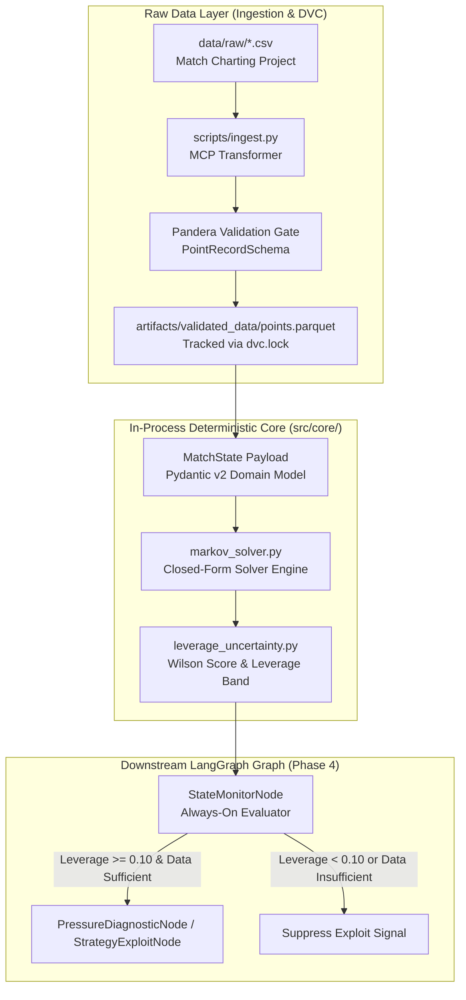
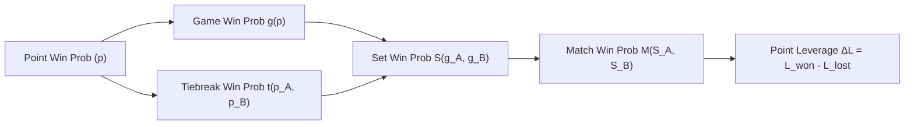
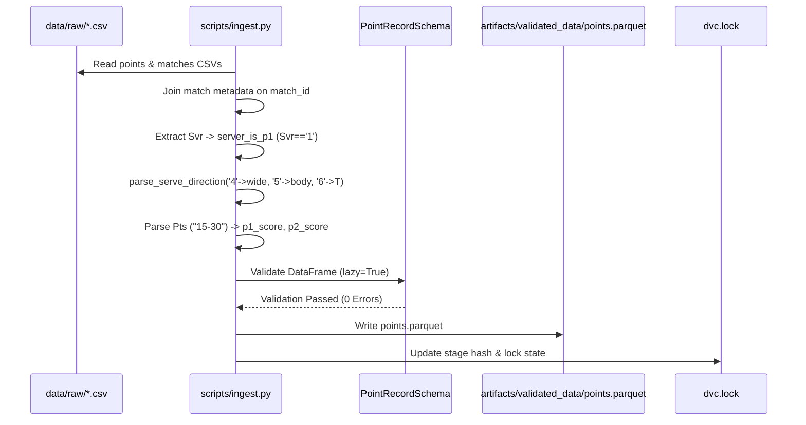

# Phase 2 — Data Layer & Deterministic Core: Architectural Report

**Product:** PULSE (Point-Level Understanding & Strategic Leverage Engine)  
**Phase:** Phase 2 — Data Layer & Deterministic Core  
**Document Type:** Architecture — The What  
**Authority:** ADR-002, ADR-005, ADR-008, [`markov_solver_spec.md v1.0.1`](../../specs/markov_solver_spec.md), [`game_theory_spec.md`](../../specs/game_theory_spec.md), [`phase2_implementation_plan_and_decisions.md`](../decisions/phase2_implementation_plan_and_decisions.md)  
**Status:** Implemented ✅ | 100% Core Math & Schema Coverage | CI-Blocking Verification Passed  
**Last Updated:** 2026-08-11

---

## 0. Purpose & Scope

This document provides a comprehensive technical breakdown of **what Phase 2 built, how every component functions, and the architectural principles governing the Data Layer and Deterministic Core of PULSE.**

Phase 2 establishes the mathematical foundation of PULSE. Before any machine learning model is trained or any agentic LLM logic is invoked, PULSE relies on an **exact, closed-form Markov solver** that computes match win probabilities and point-level leverage ($\Delta L$) from point win probabilities ($p$).

### 0.1 Deliverable Index

| Deliverable | Source File / Artifact | Primary Responsibility | Status |
| :--- | :--- | :--- | :--- |
| **Hierarchical Markov Solver** | [`src/core/markov_solver.py`](../../../src/core/markov_solver.py) | Direct closed-form analytical formulas ($g, d, t, t_{\text{tail}}, S, M, \Delta L$) | ✅ Complete |
| **Leverage Uncertainty Layer** | [`src/core/leverage_uncertainty.py`](../../../src/core/leverage_uncertainty.py) | Wilson score interval $w_{\pm}(k, n)$ & direct extreme leverage propagation | ✅ Complete |
| **Domain Contracts & Schemas** | [`src/schemas/point_record.py`](../../../src/schemas/point_record.py) | Pydantic v2 `PointRecord` model & Pandera bulk validation `PointRecordSchema` | ✅ Complete |
| **Configuration Contract** | [`params.yaml`](../../../params.yaml) | Centralized parameters (`solver`, `uncertainty`, `ingestion`, `latency`) | ✅ Complete |
| **Raw Data Ingestion Pipeline** | [`scripts/ingest.py`](../../../scripts/ingest.py) | MCP raw dataset transformer, serve parser, Pandera gate, Parquet output writer | ✅ Complete |
| **DVC Pipeline Orchestration** | [`dvc.yaml`](../../../dvc.yaml) & `dvc.lock` | Data versioning & reproducible `ingest` stage execution | ✅ Complete |
| **CI-Blocking Solver Verification** | [`tests/unit/test_markov_solver.py`](../../../tests/unit/test_markov_solver.py) | `@pytest.mark.solver` golden-value unit tests ($10^{-9}$ tolerance check) | ✅ Complete |

---

## 1. System Architecture & Topology Overview

### 1.1 In-Process Execution Topology

In accordance with project invariants, **the Markov solver, leverage uncertainty layer, and domain schemas execute strictly in-process within the Python runtime.** They do not require external HTTP/REST microservice hops or network inter-process communication (IPC). This design guarantees sub-millisecond execution per point state, keeping the total runtime far within the strict $< 1\text{s}$ per-point latency budget required for real-time match monitoring (`StateMonitorNode`).



---

## 2. Domain Schema & Validation Gate (`src/schemas/point_record.py`)

The data layer uses **co-located Pydantic v2 and Pandera schemas** to ensure zero malformed point records enter the system downstream.

### 2.1 Domain Enums & Score Coercion

Tennis scoring follows non-standard numerical progression (`0`, `15`, `30`, `40`, `AD`). Raw CSV exports frequently mix data types (e.g., `"0"`, `0`, `0.0`, `"A"`, `"40"`, `"AD"`).

- **`ValidPointScore` Enum**: Enforces exact string scores (`"0"`, `"15"`, `"30"`, `"40"`, `"AD"`). String normalization standardizes `"A"` $\rightarrow$ `"AD"`.
- **`Surface` Enum**: Enforces standardized court surfaces (`HARD`, `CLAY`, `GRASS`).
- **`PointOutcome` Enum**: Normalizes point outcomes relative to server/returner roles (`SERVER`, `RETURNER`).

### 2.2 Server Identity & `server_is_p1` Derivation

A common bug in sports analytics pipelines is inferring player identities from per-point serve strings or assuming the server is always "Player 1". In tennis:
- **Player 1 (`p1`)**: The player who served first in the match (a fixed match-level identity).
- **`server_is_p1` (Boolean)**: Explicitly indicates whether Player 1 is currently serving the point (`True`) or returning (`False`). In Match Charting Project (MCP) raw exports, `Svr == '1'` directly maps to `server_is_p1 = True`.

### 2.3 Pandera Bulk Validation (`PointRecordSchema`)

While Pydantic handles individual point instantiation in memory, `PointRecordSchema` (Pandera DataFrame schema) provides vector-accelerated validation over entire Parquet datasets during ingestion:

```python
class PointRecordSchema(pa.DataFrameModel):
    match_id: pa.typing.Series[str] = pa.Field(nullable=False)
    point_id: pa.typing.Series[str] = pa.Field(nullable=False, unique=True)
    server_is_p1: pa.typing.Series[bool] = pa.Field(nullable=False)
    p1_games: pa.typing.Series[int] = pa.Field(ge=0, le=7)
    p2_games: pa.typing.Series[int] = pa.Field(ge=0, le=7)
    p1_sets: pa.typing.Series[int] = pa.Field(ge=0, le=3)
    p2_sets: pa.typing.Series[int] = pa.Field(ge=0, le=3)
    rally_length: pa.typing.Series[int] = pa.Field(ge=0)
    
    class Config:
        coerce = True
        strict = False  # Allows metadata columns without failing pipeline
```

---

## 3. Closed-Form Markov Solver Engine (`src/core/markov_solver.py`)

The Markov solver is the **mathematical ground truth** of PULSE. It computes match win probabilities via direct closed-form formulas rather than Monte Carlo simulation, ensuring zero stochastic noise and $< 10^{-9}$ mathematical precision.

### 3.1 Mathematical Hierarchy & Formulation



#### 1. Game Win Probability $g(p)$
For a standard tennis game where server point-win probability is $p$ and $q = 1 - p$:

$$g(p) = \frac{p^4 (15 - 34p + 28p^2 - 8p^3)}{1 - 2p(1 - p)}$$

- **Deuce Recurrence $d(p)$**: Probability of winning from $40\text{--}40$ deuce:
  $$d(p) = \frac{p^2}{p^2 + q^2}$$

#### 2. Tiebreak Deuce Tail $t_{\text{tail}}(p_A, p_B)$ (ADR-008 Fix)
In a tiebreak reaching $6\text{--}6$ (or $9\text{--}9$ in 10-point match tiebreaks), twelve points have been played. Point 13 is the **second point of Player A's serve turn**. The serve sequence follows $1\text{--}2\text{--}2\text{--}2\dots$ ($A, B, B, A, A, B, B\dots$).

The closed-form deuce tail accounts for the exact 2-point alternating serve block:

$$t_{\text{tail}}(p_A, p_B) = \frac{p_A \cdot p_B}{1 - p_A - p_B + 2 p_A p_B}$$

Where:
- $p_A$: Player A's point-win probability on A's serve.
- $p_B$: Player B's point-win probability on B's serve.

#### 3. Set Win Probability $S(g_A, g_B)$
Combines standard games held/broken with 7-point tiebreak evaluation when set score reaches $6\text{--}6$.

#### 4. Match Win Probability $M(S_A, S_B)$
Evaluates set-level progression for **Best-of-3** (target 2 sets) and **Best-of-5** (target 3 sets) matches.

#### 5. Point Leverage $\Delta L$
Point leverage measures the difference in match win probability depending on whether the server wins or loses the current point:

$$\Delta L(s) = L_{\text{won}}(s) - L_{\text{lost}}(s) = M(\text{advance}(s, \text{win})) - M(\text{advance}(s, \text{loss}))$$

---

## 4. Wilson Score Interval & Leverage Uncertainty Layer (`src/core/leverage_uncertainty.py`)

A fundamental rule of PULSE is the **Sufficiency Gate**: raw point estimates ($\hat{p} = \frac{k}{n}$) from small sample sizes must propagate their statistical uncertainty to downstream leverage values.

### 4.1 Wilson Score Confidence Bounds $w_{\pm}(k, n)$

Unlike standard normal approximation intervals (which collapse or go out of bounds near 0 or 1), the **Wilson score interval** with continuity correction yields valid confidence bounds for small sample sizes $n$:

$$w_{\pm} = \frac{\hat{p} + \frac{Z^2}{2n} \pm Z \sqrt{\frac{\hat{p}(1 - \hat{p})}{n} + \frac{Z^2}{4n^2}}}{1 + \frac{Z^2}{n}}$$

Where $Z = 1.96$ for a 95% confidence level ($\alpha = 0.05$).

### 4.2 Direct Extreme Leverage Propagation

Because the Markov solver function $M(p)$ is strictly monotonic with respect to $p$, the upper and lower confidence bounds of leverage ($L_{LB}, L_{UB}$) are obtained by directly evaluating the closed-form solver at the Wilson extremes:

$$L_{LB} = \Delta L(w_{-}), \quad L_{UB} = \Delta L(w_{+})$$

- **Uncertainty Bandwidth**: $\text{Bandwidth} = L_{UB} - L_{LB}$.
- **Sufficiency Gate Criterion**: If observation count $n < n_{\text{min}}$ (defined in `params.yaml`, default $n_{\text{min}} = 10$), `is_sufficient_sample = False`, suppressing downstream exploit generation while safely reporting the leverage confidence band.

---

## 5. Data Ingestion & DVC Pipeline Stage (`scripts/ingest.py` & `dvc.yaml`)

The ingestion module transforms raw Match Charting Project (MCP) CSV files into validated, compressed Parquet files.



---

## 6. Design Patterns & Custom Exception Hierarchy

### 6.1 Architectural Patterns

1. **Ground-Truth Primacy**: Pure Python analytical functions with `@cache` memoization for exact recursive state evaluation.
2. **Fail-Loud Exception Policy**: Custom exceptions inherit from `BasePulseException` in `src/utils/exceptions.py`. Silent fallbacks or swallowed exceptions are strictly prohibited.
3. **Parameter Centralization**: Zero hardcoded thresholds; all parameters load from `params.yaml`.

```python
# Custom Exception Hierarchy in src/utils/exceptions.py
class BasePulseException(Exception):
    """Base exception for all PULSE engine errors."""


class SolverException(BasePulseException):
    """Raised when Markov solver encounters mathematical or domain state errors."""


class SufficiencyGateException(BasePulseException):
    """Raised when data sufficiency thresholds are violated."""


class IngestionException(BasePulseException):
    """Raised when raw CSV parsing or schema validation fails."""
```

---

## 7. Quality Gates & Verification Standard

Phase 2 enforces a **zero-tolerance build quality policy** across four automated tooling checks:

| Verification Tool | Command | Pass Criteria | Phase 2 Result |
| :--- | :--- | :--- | :--- |
| **Pytest Suite** | `uv run pytest` | 100% pass rate across 19 unit test cases | 🟢 19 / 19 Passed |
| **Solver Correctness** | `uv run pytest -m solver` | Max deviation vs theory $< 10^{-9}$ | 🟢 Passed |
| **Ruff Code Style** | `uv run ruff check .` | 0 linter errors, 100-char line limit | 🟢 Passed |
| **Pyright Type Checker** | `uv run pyright` | Strict mode: 0 errors, 0 warnings | 🟢 Passed |
| **File-Size Ceiling** | `python scripts/check_file_size.py` | All `src/` Python files $< 1,000$ lines | 🟢 0 Violations |
