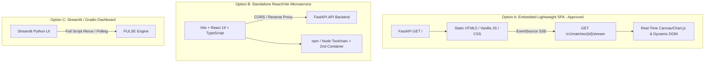

# UI Assessment & Architectural Decision: Interactive Tactical Cockpit

**Product:** PULSE | **Decision Status:** 🟢 Approved — Option A (Embedded Lightweight Real-Time Cockpit)  
**Authority:** `system_design.md` (ADR-013), `prd.md` (FR-13), `technical_roadmap.md` (Phase 6.5)  
**Approved by:** Sebastian (2026-08-22)

---

> [!IMPORTANT]
> **Approved Decision: Option A (Embedded Lightweight Real-Time Cockpit).**  
> We adopt an embedded single-page application (`src/api/static/index.html`, `app.js`, `style.css`) mounted natively inside FastAPI via `StaticFiles` and served at `/` and `/ui`. The frontend connects directly to `GET /v1/matches/{match_id}/stream` via native browser `EventSource` (SSE). This provides a zero-build, zero-overhead interactive visualization cockpit for portfolio managers, recruitment managers, and technical evaluators while maintaining 100% Python/Docker cleanliness.

---

### 1. Audience Persona & Impact Analysis

| Audience Persona | What They Evaluate | Why a Real-Time UI is Decisive |
| :--- | :--- | :--- |
| **Technical Evaluators & Hiring Managers** *(Staff / Principal Engineers, MLOps Leads)* | • Architectural separation (Math vs. LLM)<br>• Event-driven streaming latency (<1s)<br>• LangGraph conditional orchestration<br>• Wilson confidence intervals & sample gates | Proves the SSE/WebSocket pipeline works live; visually demonstrates when nodes fire vs. suppress under the **Sufficiency Gate**; shows real-time telemetry and call-stack latency. |
| **Portfolio & Hiring Managers** *(Engineering Directors, Tech Recruiters)* | • End-to-end product completeness<br>• Visual polish & UX ergonomics<br>• Practical business/domain applicability | Translates abstract probability theory into an intuitive tactical cockpit. A recruiter or manager spending 60 seconds reviewing a project will immediately grasp what PULSE does. |
| **Domain / Sports Analytics Stakeholders** *(Performance Analysts, Coaches)* | • Tactical explainability<br>• Actionable advisory signals<br>• Noise vs. leverage distinction | Makes high-leverage momentum swings visible in real time alongside game-theoretic exploit recommendations and LLM coach notes. |

---

### 2. Comparative Architectural Options

In accordance with our architectural decision framework, here is a comparative evaluation of four distinct UI approaches:



---

#### Option A: Embedded Lightweight Real-Time Cockpit (Vanilla HTML5 / Modern CSS / ES6 / Chart.js) — *(Approved)*

- **Architecture**: A single-page dashboard (`src/api/static/index.html`, `app.js`, `style.css`) mounted directly inside FastAPI via `StaticFiles` and served at `/` or `/ui`. Connects natively to the existing `GET /v1/matches/{match_id}/stream` SSE endpoint via standard browser `EventSource`.
- **Stack**: HTML5, Vanilla CSS (dark-mode, glassmorphism design system), ES6 Modules, Chart.js / Canvas for leverage timeline rendering. Zero npm, zero Node.js build steps.
- **Trade-offs**:
  - 🟢 **Zero Build Friction**: No Node.js or `npm` dependencies in the repo, CI pipeline, or Dockerfile. The deployable container remains a clean, single-stage Python runtime.
  - 🟢 **Unified Deployment**: Running `uv run api.main` or `docker compose up --build` immediately exposes both the API and the full interactive cockpit at `http://localhost:8000/`.
  - 🟢 **Zero CORS / Network Complexity**: Operates on the same origin as the streaming API.
  - 🟢 **Ultra-low Footprint**: Total static asset size < 100 KB; sub-millisecond asset delivery.
  - 🔴 **State Management**: Complex multi-page routing is avoided (though for a single-page match streaming cockpit, vanilla reactive state is straightforward).

---

#### Option B: Standalone Modern SPA Microservice (Vite + React + TypeScript + TailwindCSS)

- **Architecture**: A separate `frontend/` directory with a full React/TypeScript SPA communicating across origins or via a reverse proxy to FastAPI.
- **Stack**: Vite, React 19, TypeScript, TailwindCSS, Lucide-React, Recharts.
- **Trade-offs**:
  - 🟢 **Rich Component Ecosystem**: Ready-made UI component libraries (shadcn/ui, Radix).
  - 🔴 **Build & Tooling Overhead**: Introduces Node.js, `pnpm`/`npm`, `package.json`, ESLint, and a multi-stage Docker build or a second container in `docker-compose.yml`.
  - 🔴 **CI/CD Complexity**: GitHub Actions now requires Node testing and build steps alongside the Python/Ruff/Pyright/pytest pipeline.
  - 🔴 **Scope Dilution**: Shifts repository focus toward frontend scaffolding rather than pure MLOps, probability theory, and agent orchestration.

---

#### Option C: Python-Native Reactive Framework (Streamlit / Gradio)

- **Architecture**: A pure Python dashboard script running alongside the engine.
- **Stack**: Streamlit or Gradio.
- **Trade-offs**:
  - 🟢 **100% Python Code**: No JavaScript or HTML required.
  - 🔴 **Architectural Mismatch with SSE**: Streamlit executes via full-script re-runs on state changes; it struggles with smooth, low-latency, point-by-point SSE stream visualization.
  - 🔴 **Evaluator Perception**: Often perceived by senior hiring managers as a rapid data science prototype rather than a production-grade streaming system.

---

#### Option D: Headless API Status Quo (No UI)

- **Architecture**: Keep PULSE strictly as a headless API & engine. Rely solely on FastAPI Swagger docs (`/docs`), CLI terminal replays (`uv run simulator.replay`), and markdown evaluation reports.
- **Trade-offs**:
  - 🟢 **Zero Additional Code**: No frontend code to write or maintain.
  - 🔴 **Low Evaluator Engagement**: Evaluators must manually trigger curl/SSE clients or read JSON files, missing the live impact of the leverage swings and conditional escalations.

---

### 3. Proposed UI Cockpit Blueprint ("PULSE Tactical Dashboard")

The UI features a sleek, dark-mode tactical cockpit designed around PULSE's 4 core architectural pillars:

```
+----------------------------------------------------------------------------------------------------+
|  PULSE — Point-Level Understanding & Strategic Leverage Engine                   [Match Selector v] |
|  Status: Streaming (1.0x)  |  Score: Alcaraz vs Djokovic  |  Set 2: [4-4, 30-40] *Break Point*      |
+----------------------------------------------------------------------------------------------------+
|  [ 1. LIVE LEVERAGE & MOMENTUM TIMELINE (Chart.js / Canvas)                                        ] |
|   Delta L (%)                                                                                      |
|   15% |            /\                                          -- Escalation Threshold (tau = 5%)  |
|   10% |           /  \      /\                                                                     |
|    5% |----------/----\----/--\---------------------------------                                   |
|    0% |___/\____/______\__/____\________ [Shaded Wilson 95% Confidence Band]                       |
|       Point 1 ......................................... Point 84 (Current: Delta L = 12.4% +/- 1.8%)|
+----------------------------------------------------------------------------------------------------+
|  [ 2. LANGGRAPH CONDITIONAL TOPOLOGY ]    |  [ 3. GAME-THEORETIC EXPLOIT (T-2) ]                   |
|  • StateMonitorNode:      🟢 ACTIVE (12ms) |  • Opponent: N. Djokovic                               |
|  • PressureDiagnosticNode:🟢 FIRED  (18ms) |  • Wide vs Body Serve Payoff Matrix: [2x2 Grid]        |
|    - Delta P: -4.2% (Shrinkage: 0.68)      |  • Nash Equilibrium: 54% Wide / 46% T                  |
|  • StrategyExploitNode:   🟢 FIRED  (25ms) |  • Observed Bias: 72% Wide (N = 28 >= 10 Sufficiency)  |
|    - Sufficiency Gate: PASSED (N=28 >= 10) |  • Recommended Exploit: Serve T (+6.8% EV Gain)        |
|  • TacticalOutputNode:    🟣 LLM SYNTHESIS |                                                        |
+----------------------------------------------------------------------------------------------------+
|  [ 4. COACH / BROADCAST TACTICAL FEED (Real-Time Advisory Card)                                    ] |
|  Headline: Critical Break Point — Exploit Opponent Wide-Serve Bias                                 |
|  Narrative: Leverage has surged to 12.4% (Set 2, 4-4, 30-40). Pressure model detects server       |
|             win-rate degradation of -4.2%. Returner shows statistically significant wide-coverage   |
|             bias. Exploit serve down the T yields +6.8% expected win probability.                  |
+----------------------------------------------------------------------------------------------------+
|  Controls: [Play / Pause]  [Speed: 0.5x | 1x | 2x | Max]  [Latency: 58ms]  [OTel Trace ID: #4f8a9]  |
+----------------------------------------------------------------------------------------------------+
```

---

### 4. Lifecycle & Sequencing Resolution

| Approach | Timeline & Scope | Impact on Phase 7 |
| :--- | :--- | :--- |
| **Option A1: Add UI as Phase 6.5 (Approved)** | Build minimal static UI (`src/api/static/`) before Phase 7 execution. | **High Benefit:** Phase 7's Docker image and `docker compose up --build` instantly ship with the working UI ready for the final shadow-mode acceptance run. |
| **Option A2: Integrate UI into Phase 7** | Add the UI implementation as Stage 1 of Phase 7's Execution Plan. | Keeps all deployment, CI/CD, and acceptance artifacts aligned in a single final milestone. |
| **Option D: Skip UI** | Proceed directly to Phase 7 headless CI/CD & Acceptance. | Fastest path to milestone closure, but misses visual portfolio presentation. |

---

### 5. Final Approval & Next Steps

Option A1 is approved. The static assets (`src/api/static/index.html`, `src/api/static/app.js`, `src/api/static/style.css`) will be implemented under Phase 6.5 and mounted in `src/api/main.py` via `app.mount("/", StaticFiles(directory=static_dir, html=True), name="static")`. All downstream reference documents (`ml_canvas.md`, `project_charter.md`, `prd.md`, `technical_roadmap.md`, `user_story.md`, and `system_design.md`) are updated accordingly.
