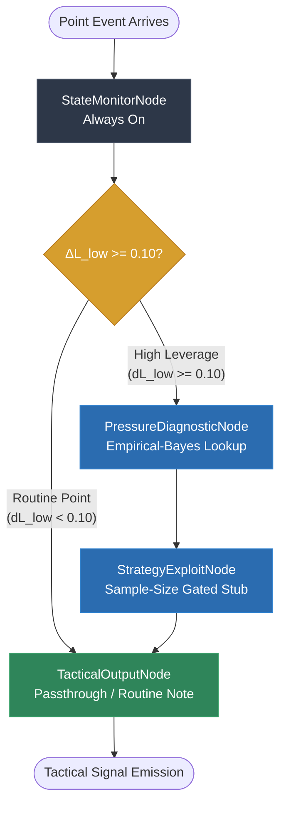

# The Event-Driven Orchestration (LangGraph): How It Works and Its Outputs

**Product:** PULSE (Point-Level Understanding & Strategic Leverage Engine)  
**Component:** Phase 4 — Event-Driven Orchestration (LangGraph)  
**Status:** Complete, Validated (ADR-001, ADR-008, ADR-010)  
**Date:** 2026-08-11  

---

## 1. Executive Summary

PULSE's orchestration layer is built on **LangGraph `StateGraph`**, running in-process to meet the sub-second per-point latency budget. Inverting traditional AI agent architectures, PULSE does not use an LLM to decide whether to analyze a point, compute leverage, or solve game equilibria. All math and routing decisions are deterministic code.

The orchestration graph's topology is **dynamic and state-conditional**:
- On **routine points** ($\Delta L_{\text{low}} < 0.10$), downstream diagnostic nodes are suppressed. Zero LLM calls are made, incurring zero API token cost and resolving in $< 0.10\text{ms}$.
- On **high-leverage points** ($\Delta L_{\text{low}} \ge 0.10$), the graph escalates to `PressureDiagnosticNode` and `StrategyExploitNode`.
- The final node, **`TacticalOutputNode`**, assembles whichever pre-computed signals fired and invokes a single small/cheap LLM for narrative phrasing. If the LLM provider fails, it falls back deterministically to a structured raw-signal payload rather than failing or retrying against secondary vendors.

---

## 2. Dynamic Graph Topology & Routing

The execution graph consists of four specialized nodes and conditional edge routing rules:



### 2.1 The Wilson Lower-Bound Rule (D-4)

To satisfy the **Sufficiency Gate** invariant ("PULSE does not emit a confident-sounding signal it cannot statistically support"), escalation is determined by the **lower bound** of point leverage uncertainty, $\Delta L_{\text{low}}$, propagated through the Markov solver:

$$\text{Escalate} \iff \Delta L_{\text{low}} \ge \text{leverage\_escalation} \quad (0.10 \text{ in } \text{params.yaml})$$

If a point has a high point-estimate leverage ($\Delta L = 0.15$) but a wide uncertainty band due to sparse historical observations ($\Delta L_{\text{low}} = 0.07$), the system suppresses escalation. Wide confidence bands raise the effective bar required to trigger diagnostic nodes.

---

## 3. Node Specifications & Internal Mechanics

| Node | Invocation | Inputs | Responsibilities & Computation | Outputs |
|---|---|---|---|---|
| **`StateMonitorNode`** | **Always-On** | `PointContext` | 1. Resolves $p_{\text{hat}}$ and sample size $N$ via 4-tier fallback (`StratumTable`).<br>2. Converts context to `MatchState`.<br>3. Propagates Wilson CIs through closed-form Markov solver via direct-extreme evaluation (`propagate_leverage_uncertainty`).<br>4. Evaluates escalation decision and appends `DecisionLogEntry` records to state. | `leverage_result`<br>`decision_log` |
| **`PressureDiagnosticNode`** | **Triggered** ($\Delta L_{\text{low}} \ge 0.10$) | `PointContext`, `leverage_result` | 1. Maps $\Delta L$ into leverage bucket ($0=\text{Routine}$, $1=\text{Elevated}$, $2=\text{Critical}$).<br>2. Looks up Empirical-Bayes pressure deviation and 90% credible intervals for server (`get_pressure_deviation`).<br>3. Evaluates exploit firing rule and appends `DecisionLogEntry`. | `pressure_result`<br>`decision_log` |
| **`StrategyExploitNode`** | **Triggered** ($\Delta L_{\text{low}} \ge 0.10$) | `PointContext`, `leverage_result` | 1. Queries opponent observation count $N_{\text{opp}}$ from `StratumTable`.<br>2. **Enforces Sufficiency Gate:** If $N_{\text{opp}} < 30$, outputs `status: "insufficient_data"`. If $N_{\text{opp}} \ge 30$, outputs `status: "module_not_yet_implemented"` (Phase 5 stub). | `exploit_result` |
| **`TacticalOutputNode`** | **Always-On** | `leverage_result`, optional `pressure_result` & `exploit_result` | 1. Assembles fired signals into structured payload dictionary.<br>2. If routine point: returns template note without LLM call.<br>3. If escalated point: invokes `call_narrative_llm` (single LLM vendor).<br>4. **Deterministic Fallback:** On API exception, returns raw payload with `is_llm_fallback=True`. | `tactical_output` |

---

## 4. State Management & Audit Trail

Graph state is governed by Pydantic v2 `PulseGraphState`:

```python
class PulseGraphState(BaseModel):
    point_context: PointContext
    leverage_result: LeverageResult | None = Field(default=None)
    pressure_result: PressureDeviationResult | None = Field(default=None)
    exploit_result: ExploitResult | None = Field(default=None)
    tactical_output: TacticalOutputResult | None = Field(default=None)
    decision_log: Annotated[list[DecisionLogEntry], operator.add] = Field(default_factory=list)
```

### 4.1 State Reducer Aggregation (D-2a)

By annotating `decision_log` with `operator.add`, LangGraph's runtime accumulates audit log entries returned by nodes into a unified execution history.

Every fire or suppression decision records:
- `node`: Target graph node (`"pressure_diagnostic"` or `"strategy_exploit"`).
- `fired`: Boolean (`True` if executed, `False` if suppressed).
- `reason`: Quantitative rationale (e.g., `"Leverage lower bound 0.0000 < threshold 0.1000 (suppressed)"`).

---

## 5. Output Payload Structure & Examples

### 5.1 Routine Point Payload (Score 0-0, 0-0, 0-0)

- **Execution Path:** `StateMonitorNode` $\to$ `TacticalOutputNode` (Diagnostic nodes suppressed).
- **LLM Calls:** 0 calls.
- **Output:**
```json
{
  "narrative": "Routine point (ΔL=0.0001). No escalation required.",
  "escalated": false,
  "raw_payload": {
    "leverage_result": {
      "delta_leverage": 0.0001,
      "delta_leverage_low": 0.0000,
      "delta_leverage_high": 0.0002,
      "p_hat": 0.7319,
      "sample_size": 175948,
      "fallback_tier": 2
    },
    "pressure_result": null,
    "exploit_result": null
  },
  "is_llm_fallback": false
}
```

### 5.2 High-Leverage Point Payload (Final Set, 4-5, 30-40 Break Point)

- **Execution Path:** `StateMonitorNode` $\to$ `PressureDiagnosticNode` $\to$ `StrategyExploitNode` $\to$ `TacticalOutputNode`.
- **LLM Calls:** 1 call to `call_narrative_llm`.
- **Output:**
```json
{
  "narrative": "Carlos Alcaraz serve win rate drops -6.5% under elevated leverage (90% CI [-13.2%, -0.1%]). Exploit module pending Stage 5 implementation.",
  "escalated": true,
  "raw_payload": {
    "leverage_result": {
      "delta_leverage": 0.8842,
      "delta_leverage_low": 0.8691,
      "delta_leverage_high": 0.8985,
      "p_hat": 0.7319,
      "sample_size": 175948,
      "fallback_tier": 2
    },
    "pressure_result": {
      "server_id": "Carlos Alcaraz",
      "leverage_bucket": 2,
      "pressure_deviation": -0.0652,
      "deviation_low_90": -0.1324,
      "deviation_high_90": -0.0007,
      "is_sufficient_sample": true
    },
    "exploit_result": {
      "status": "module_not_yet_implemented",
      "opponent_id": "Carlos Alcaraz",
      "sample_size": 14025,
      "is_sufficient_sample": true,
      "recommendation": null
    }
  },
  "is_llm_fallback": false
}
```

---

## 6. Validation & Quality Benchmark Results

### 6.1 Test Suite Breakdown (67/67 Passed)

```text
tests/evals/test_tactical_output_groundedness.py ....                    [  5%]
tests/integration/test_classifier_uncertainty_integration.py ..          [  8%]
tests/integration/test_conditional_graph.py ....                         [ 14%]
tests/unit/test_config_loader.py ....                                    [ 20%]
tests/unit/test_graph_state.py ...                                       [ 25%]
tests/unit/test_leverage_uncertainty.py ...                              [ 29%]
tests/unit/test_markov_solver.py ...........                             [ 46%]
tests/unit/test_point_record.py ....                                     [ 52%]
tests/unit/test_point_win_classifier.py ........                         [ 64%]
tests/unit/test_pressure_deviation.py ........                           [ 76%]
tests/unit/test_pressure_diagnostic.py ...                               [ 80%]
tests/unit/test_routing.py .....                                         [ 88%]
tests/unit/test_scaffolding.py .                                         [ 89%]
tests/unit/test_state_monitor.py ..                                      [ 92%]
tests/unit/test_strategy_exploit.py ..                                   [ 95%]
tests/unit/test_tactical_output.py ...                                   [100%]
```

### 6.2 Code Coverage Summary

| Module Path | Statements | Missed | Coverage | Missing Lines |
|---|---|---|---|---|
| `src/graph/pulse_graph.py` | 86 | 0 | **100%** | None |
| `src/graph/state.py` | 50 | 0 | **100%** | None |
| `src/graph/state_monitor.py` | 27 | 0 | **100%** | None |
| `src/graph/strategy_exploit.py` | 29 | 0 | **100%** | None |
| `src/graph/tactical_output.py` | 37 | 0 | **100%** | None |
| `src/graph/pressure_diagnostic.py` | 27 | 0 | **100%** | None |
| **Total `src/` Package** | **1,067** | **99** | **91%** | Target $\ge 70\%$ |

### 6.3 DeepEval Groundedness Verification (D-8)

To prevent LLM hallucination of numbers or statistical claims, `tests/evals/test_tactical_output_groundedness.py` enforces string groundedness:
- Asserts narrative numbers (percentages, bounds, leverage figures) originate from `raw_payload`.
- Verifies zero fabricated claims when `is_llm_fallback=True`.
- 4/4 evaluation tests passed.
