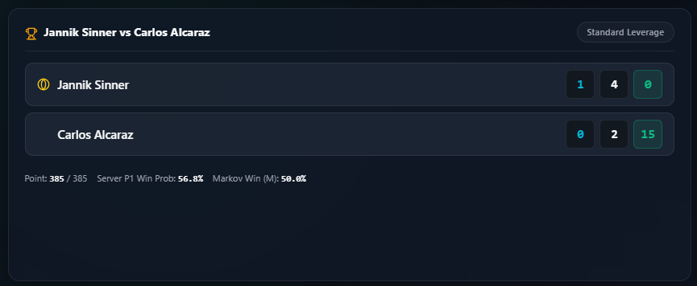
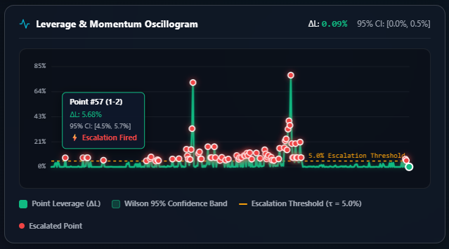
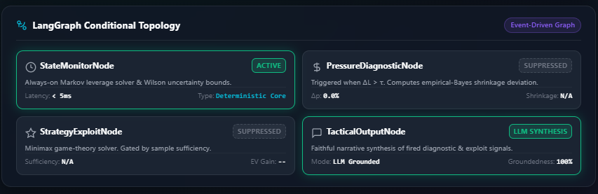
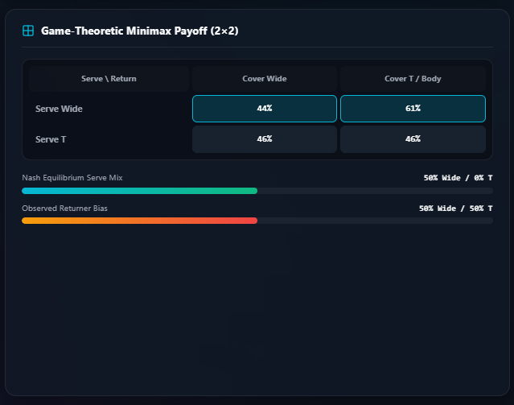
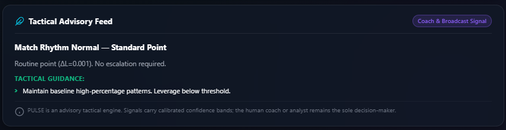
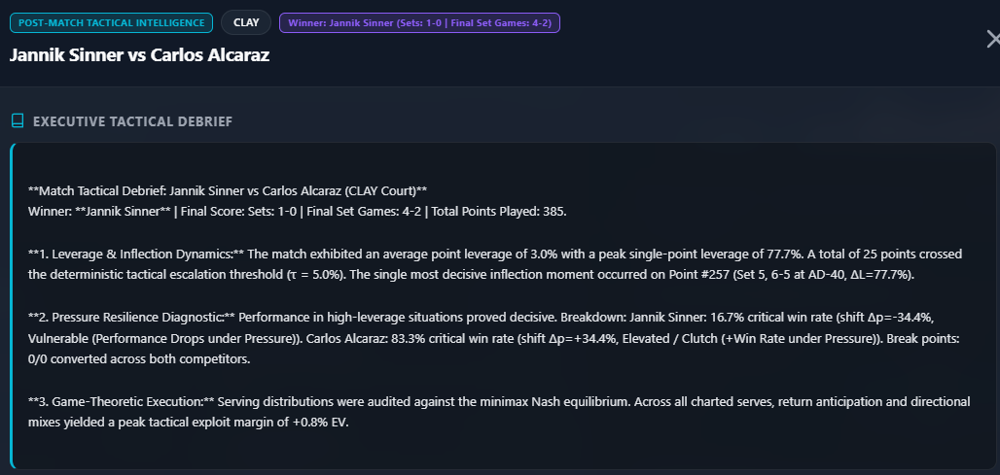
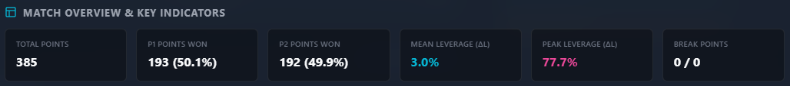
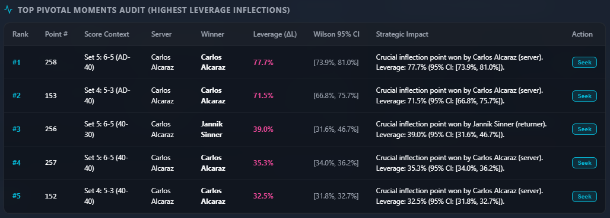
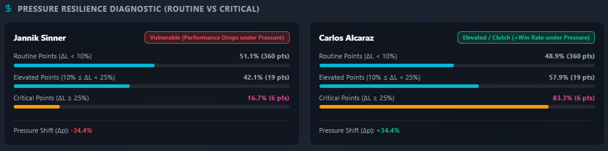
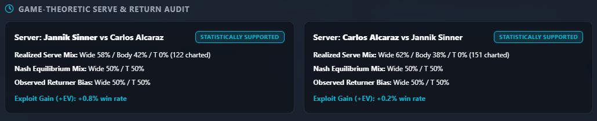

# PULSE Tactical Cockpit — Practitioner & Analyst Guide

> **Document Type:** Operational Runbook & Interpretive Manual  
> **Audience:** Tennis Coaches, Performance Analysts, Broadcast Commentators, Quantitative Evaluators  
> **System:** PULSE (Point-Level Understanding & Strategic Leverage Engine) v0.6.6  
> **Location:** `reports/docs/runbooks/tactical_cockpit_practitioner_guide.md`

---

## Executive Overview: The PULSE Mental Model

The **PULSE Tactical Cockpit** is an event-driven intelligence interface that transforms raw point-by-point tennis data into real-time, mathematically grounded strategic signals. 

Unlike traditional tennis statistics that look backward at aggregate percentages (e.g., *"first-serve percentage"* or *"unforced errors"*), PULSE looks forward after every single point to answer three fundamental questions:

1. **How critical is this exact moment in the match?** (Exact Leverage via Closed-Form Markov Solver)
2. **Does either player systematically alter their execution under pressure?** (Empirical-Bayes Pressure Deviation)
3. **Is there an exploitable game-theoretic weakness in the opponent's anticipation?** (Minimax Zero-Sum Game Theory)

```
                       ┌──────────────────────────────────────────────┐
                       │           INCOMING POINT STREAM              │
                       └──────────────────────┬───────────────────────┘
                                              │
                                              ▼
                                   ┌──────────────────────┐
                                   │   StateMonitorNode   │ ── Compute Exact Leverage (ΔL)
                                   └──────────┬───────────┘    and Wilson 95% Confidence Band
                                              │
                     ┌────────────────────────┴────────────────────────┐
                     │                                                 │
          [ΔL < 5.0% (Routine)]                            [ΔL ≥ 5.0% (Escalated)]
                     │                                                 │
                     ▼                                                 ▼
        ┌─────────────────────────┐                       ┌─────────────────────────┐
        │ Downstream Nodes        │                       │ PressureDiagnosticNode  │
        │ SUPPRESSED              │                       │ StrategyExploitNode     │
        └────────────┬────────────┘                       └────────────┬────────────┘
                     │                                                 │
                     └────────────────────────┬────────────────────────┘
                                              │
                                              ▼
                                   ┌──────────────────────┐
                                   │  TacticalOutputNode  │ ── LLM Narrative Synthesis
                                   └──────────────────────┘    (Strictly Grounded in Math)
```

> **The Core Philosophical Rule:** Deterministic mathematics is the ground truth. AI/ML is a thin, confidence-gated narrative layer on top. PULSE **never** guesses, never hallucinates numbers, and strictly suppresses recommendations whenever data is statistically insufficient.

---

## Deconstructing the Tactical Cockpit

Below is the complete visual and mathematical walkthrough of the primary interface components visible on the Tactical Cockpit dashboard.


```
┌────────────────────────────────────────────────────────────────────────────────────────┐
│ [● PULSE] Point-Level Understanding & Strategic Leverage Engine   Surface: HARD [● Stream Ended] │
├──────────────────────────────────────────┬─────────────────────────────────────────────┤
│ 1. SCOREBOARD & MATCH STATE              │ 2. LEVERAGE & MOMENTUM OSCILLOGRAM          │
│    • Set / Game / Point progression      │    • Real-time ΔL spline (60 FPS)           │
│    • Server Indicator (🎾)               │    • Shaded Wilson 95% Confidence Band      │
│    • P(Win) vs Markov Match Win M(S)     │    • Escalation Threshold (τ = 5.0%)        │
│    • Dynamic Leverage Badge              │    • Red Inflection Point Markers           │
├──────────────────────────────────────────┼─────────────────────────────────────────────┤
│ 3. LANGGRAPH CONDITIONAL TOPOLOGY        │ 4. GAME-THEORETIC MINIMAX PAYOFF (2×2)      │
│    • StateMonitorNode (Active)           │    • Serve Direction vs Return Anticipation │
│    • PressureDiagnosticNode (Suppressed) │    • Nash Equilibrium vs Observed Bias      │
│    • StrategyExploitNode (Suppressed)    │    • +EV Expected Value Gain Callout        │
│    • TacticalOutputNode (LLM Grounded)   │    • Opponent Sample Sufficiency Monitor    │
├──────────────────────────────────────────┴─────────────────────────────────────────────┤
│ 5. TACTICAL ADVISORY FEED                                                              │
│    • Strategic Headline & Narrative Guidance                                           │
│    • Coach & Broadcast Advisory Signal                                                 │
├────────────────────────────────────────────────────────────────────────────────────────┤
│ 6. REPLAY CONTROL BAR                                                                  │
│    • Match Catalogue Selection │ Speed Multiplier (0.5x, 1x, 2x, Instant) │ Trace ID   │
└────────────────────────────────────────────────────────────────────────────────────────┘
```

---

### Panel 1: Scoreboard & Real-Time Match State

The top-left panel anchors the real-time scoring context of the live match.



#### Visual Elements & Metrics
- **Player Names & Surface:** Identifies the active competitors (e.g., *Jannik Sinner vs Carlos Alcaraz*) and court surface (*HARD, CLAY, GRASS*).
- **Tennis Scoring Boxes:** Displays current Sets, Games, and Point score (e.g., `1 Set`, `4 Games`, `0 Points` vs `0 Sets`, `2 Games`, `15 Points`).
- **Server Indicator (🎾):** A golden ball icon highlights which player currently has the serve advantage.
- **Server P1 Win Prob ($p_{\text{hat}}$):** The point-win probability estimated by the calibrated Phase 3 logistic classifier based on server identity, returner identity, surface, and whether it is a 1st or 2nd serve.
- **Markov Win ($M(S)$):** The exact, closed-form match win probability from the current score state $S$, computed deterministically by the Markov chain solver.
- **Leverage Badge:** Indicates the tactical gravity of the current point:
  - `STANDARD LEVERAGE` (Grey/Muted): Routine point ($\Delta L < 5.0\%$).
  - `HIGH LEVERAGE` (Golden/Pulsing): High-stakes turning point ($\Delta L \ge 5.0\%$).
  - `CRITICAL LEVERAGE` (Crimson/Pulsing): High-stakes break point or match point ($\Delta L \ge 10.0\%$).

---

### Panel 2: Leverage & Momentum Oscillogram

The top-right panel visualizes the mathematical turning points of the match over time using a bespoke Canvas 2D engine.



```
Leverage (ΔL)
  85% │                                                      ● (Match Point)
  64% │                                                      │
  43% │                                                  ●   │
  21% │                ●       ●                     ●   │   │
   5% ├───●────●───●───┼───────┼───────●───●─────●───┼───┼───┼─── Escalation Line (τ=5.0%)
   0% └───┴────┴───┴───┴───────┴───────┴───┴─────┴───┴───┴───┴─── Points (0 -> 385)
```

#### What is Point Leverage ($\Delta L$)?
Point leverage measures the **exact change in match win probability** at stake on the upcoming point:

$$\Delta L(S) = M(\text{win point} \mid S) - M(\text{lose point} \mid S)$$

- On a routine point (e.g., $0-0$ in the first game), winning or losing changes match win probability by less than $1\%-2\%$ ($\Delta L \approx 0.015$).
- On a high-pressure point (e.g., Break Point, Set Point, or $40-30$ serving for the match in the deciding set), winning the point wins the match, while losing extends the set. The leverage can spike to **$40\%-80\%+$**.

#### Visual Elements
- **Glowing Green Spline:** The continuous trajectory of point leverage ($\Delta L$) across all points played.
- **Shaded Wilson 95% Confidence Band:** An uncertainty envelope $[L_{\text{low}}, L_{\text{high}}]$ propagated directly through the Markov solver from the Wilson score interval of $p$. A wide band indicates small historical sample size; a narrow band indicates high certainty.
- **Dashed Orange Threshold ($\tau = 5.0\%$):** The deterministic boundary for tactical escalation. Points above this line trigger deep analytical evaluation.
- **Red Inflection Markers (●):** Points where leverage exceeded the escalation threshold, flagging pivotal moments for retrospective review.
- **Interactive Inspection Tooltip:** Hovering over any point reveals the point index, game score, $\Delta L$ percentage, Wilson confidence band, and escalation status.

---

### Panel 3: LangGraph Conditional Topology Inspector

The middle-left panel displays the live execution state of PULSE's agentic graph.



```
┌───────────────────────────┐    ┌───────────────────────────┐
│ StateMonitorNode          │    │ PressureDiagnosticNode    │
│ Status: ACTIVE            │    │ Status: SUPPRESSED        │
│ Latency: < 5ms            │    │ Reason: ΔL < 5.0%         │
└─────────────┬─────────────┘    └───────────────────────────┘
              │
              ▼
┌───────────────────────────┐    ┌───────────────────────────┐
│ StrategyExploitNode       │    │ TacticalOutputNode        │
│ Status: SUPPRESSED        │    │ Status: LLM SYNTHESIS     │
│ Reason: ΔL < 5.0%         │    │ Mode: LLM Grounded (100%) │
└───────────────────────────┘    └───────────────────────────┘
```

#### Node Roles & Status Meanings
1. **`StateMonitorNode` (Always Active):**
   - Runs on 100% of points with sub-5ms latency.
   - Computes $M(S)$, $\Delta L$, and the Wilson confidence interval.
2. **`PressureDiagnosticNode` (`TRIGGERED` vs `SUPPRESSED`):**
   - **Trigger Condition:** Lower bound of leverage $\Delta L_{\text{low}} \ge \tau = 5.0\%$.
   - **What it does:** Looks up player performance under pressure vs routine situations using Empirical-Bayes shrinkage ($\Delta p = p_{\text{pressure}} - p_{\text{routine}}$).
   - **Why it shows SUPPRESSED:** On routine points, executing pressure diagnostics adds zero analytical value and wastes compute.
3. **`StrategyExploitNode` (`TRIGGERED` vs `SUPPRESSED` / `GATED`):**
   - **Trigger Condition:** High leverage ($\Delta L_{\text{low}} \ge \tau$) **AND** opponent sample sufficiency ($N_{\text{opp}} \ge 10$).
   - **What it does:** Solves a zero-sum minimax linear program to calculate the optimal serve mix and detect exploitable returner anticipation bias.
   - **Why it shows GATED:** If fewer than 10 points are charted for this specific opponent on this surface, PULSE refuses to fabricate an exploit.
4. **`TacticalOutputNode` (`LLM SYNTHESIS` / `PASSTHROUGH`):**
   - Synthesizes the active node outputs into a coach-readable brief.
   - Enforces **100% numerical groundedness** (verified via DeepEval in CI): the LLM cannot invent percentages or recommendations absent from the deterministic payload.

---

### Panel 4: Game-Theoretic Minimax Payoff Panel

The middle-right panel computes optimal serving tactics against the opponent's return positioning.



```
                 COVER WIDE          COVER T / BODY
               ┌───────────────────┬───────────────────┐
  SERVE WIDE   │       44%         │       61% ★       │  <-- Best Response Cell
               ├───────────────────┼───────────────────┤
  SERVE T      │       46%         │       46%         │
               └───────────────────┴───────────────────┘

  Nash Equilibrium Serve Mix : [████████████░░░░░░░░░░░░] 50% Wide / 50% T
  Observed Returner Bias     : [████████████░░░░░░░░░░░░] 50% Wide / 50% T
  Exploit Opportunity (+EV)  : +1.7% EV on serve wide
```

#### Understanding the 2×2 Payoff Matrix
- **Rows (Server Actions):** Serving *Wide* vs Serving down the *T* (center).
- **Columns (Returner Anticipation):** Covering *Wide* vs Covering the *T / Body*.
- **Cell Values ($\Pi_{ij}$):** Empirical win percentage when the server chooses action $i$ and returner anticipates action $j$.
  - *Example:* If Server serves **Wide** and Returner is **Covering T**, the server wins the point **61%** of the time (mismatched anticipation).
- **Nash Equilibrium Mix ($x^*$):** The game-theoretically unexploitable serve distribution (e.g., 50% Wide / 50% T).
- **Observed Returner Bias ($\hat{y}$):** The empirical probability distribution of where the returner actually leans on pressure points.
- **Exploitation Margin ($\delta$):** If the returner leans heavily toward one side (e.g., 80% Wide), the server can exploit this by shifting serve selection, yielding an Expected Value gain ($+\text{EV}$).

---

### Panel 5: Tactical Advisory Feed

The lower panel synthesizes all active mathematical layers into a clear coaching signal.



- **Headline:** Categorizes point rhythm (e.g., *"Match Rhythm Normal — Standard Point"* vs *"Critical Tactical Leverage Escalation"*).
- **Narrative:** Concise operational summary referencing exact mathematical figures ($\Delta L$, $\Delta p$, $\delta$).
- **Tactical Guidance:** Actionable instructions for the coach or broadcast commentator:
  - *Routine:* "Maintain baseline high-percentage patterns. Leverage below threshold."
  - *Escalated + Exploit:* "Target Wide serve on Deuce court: returner leans T under pressure (+1.7% EV gain)."
- **Advisory Disclaimer:** A mandatory reminder that PULSE provides advisory intelligence; human expertise retains sole decision authority.

---

### Panel 6: Stream Control Bar

The bottom bar controls the simulation engine:
- **Match Selector:** Choose from over 3,300 ATP matches charted in the dataset.
- **Speed Multiplier:** Select playback cadence:
  - `0.5x` / `1.0x` / `2.0x`: Realistic pacing for real-time simulation.
  - `Instant`: Zero-delay processing for instant whole-match tactical diagnosis.
- **Controls:** `Start Replay`, `Pause`, `Reset`.
- **View Post-Match Report button (`📑`):** Opens the comprehensive, retrospective match debrief modal.
- **Trace Badge:** Shows the active OpenTelemetry trace ID (e.g., `pt-384-20250608`) for debugging and audit logging.

---

### Panel 7: Post-Match Tactical Intelligence Modal

Accessible via the `View Post-Match Report` button in the Control Bar, this comprehensive retrospective intelligence overlay aggregates whole-match analytical metrics across five specialized diagnostic sections:

#### 1. Executive Tactical Debrief
Synthesizes a 3-paragraph executive summary powered by the active Groq Cloud LPU engine (`groq/compound-mini` or Anthropic, with deterministic raw fallback), strictly grounded with 0% numerical hallucinations:



- **Match Overview & Winner Banner:** Identifies match outcome, final sets/games score, and total points charted (e.g., *Jannik Sinner def. Carlos Alcaraz, 385 points played*).
- **Paragraph 1 (Leverage & Inflection Dynamics):** Summarizes mean match leverage ($\mu_{\Delta L} = 3.0\%$), peak single-point leverage ($\Delta L_{\max} = 77.7\%$ on Point #257), and count of escalated points ($N_{\text{escalated}} = 25$).
- **Paragraph 2 (Pressure Resilience Diagnostic):** Evaluates critical-tier win rates and pressure shifts ($\Delta p$) across both competitors.
- **Paragraph 3 (Game-Theoretic Audit):** Audits overall serve distributions and exploitable returner anticipation margins ($+\text{EV}$).

---

#### 2. Match Overview & Key Indicators
Displays aggregate statistical cards summarizing the primary numerical dimensions of the completed contest:



- **Total Points:** Complete volume of charted points ($385$).
- **Points Won Distribution:** Exact point counts and percentage shares for Server P1 ($193 / 50.1\%$) and Returner P2 ($192 / 49.9\%$).
- **Mean Leverage ($\Delta L$):** Match-wide baseline tactical leverage ($3.0\%$).
- **Peak Leverage ($\Delta L$):** Maximum tactical swing recorded during the match ($77.7\%$).
- **Break Points Converted:** Break point efficiency statistics across both competitors.

---

#### 3. Top Pivotal Moments Audit Table
Ranks the top 5 highest-leverage inflection moments of the match in descending order of tactical importance:



- **Score Context & Server/Winner Identification:** Pinpoints exact set, game score, and point score (e.g., *Set 5: 6-5 (AD-40)*).
- **Leverage ($\Delta L$) & Wilson 95% CI:** Displays exact calculated point leverage alongside its mathematical uncertainty interval (e.g., $77.7\%$, $95\%\text{ CI: }[73.9\%, 81.0\%]$).
- **Strategic Impact Narrative:** Explains the deterministic significance of the point outcome.
- **Interactive `Seek` Action:** Clicking the **Seek** button closes the report modal and immediately rewinds the main oscillogram and cockpit timeline to that exact point index.

---

#### 4. Pressure Resilience Diagnostic (Routine vs Critical)
Compares player point-win rates across three deterministic leverage tiers ($[0, 10\%)$ Routine, $[10\%, 25\%)$ Elevated, and $[25\%, 100\%]$ Critical):



- **Player Resilience Badges:** Categorizes players as *Elevated / Clutch* ($\Delta p > +3.0\%$), *Steady* ($-3\% \le \Delta p \le +3\%$), or *Vulnerable* ($\Delta p < -3.0\%$).
- **Leverage Tier Progress Bars:** Visualizes win rates and point volumes per tier (e.g., *Sinner: 51.1% Routine vs 16.7% Critical; Alcaraz: 48.9% Routine vs 83.3% Critical*).
- **Pressure Shift ($\Delta p$):** Quantifies empirical-Bayes shrunk performance delta under high pressure ($\Delta p_{\text{Sinner}} = -34.4\%$, $\Delta p_{\text{Alcaraz}} = +34.4\%$).

---

#### 5. Game-Theoretic Serve & Return Audit
Audits realized serve distributions against minimax Nash equilibrium for both competitors:



- **Statistical Sufficiency Status:** Confirms sample sufficiency ($N \ge 10$ charted points per server).
- **Realized vs Nash Serve Mix:** Compares actual serve direction shares (*Wide / Body / T*) against the optimal minimax distribution.
- **Observed Returner Bias:** Evaluates whether returners favored covering Wide or T under pressure.
- **Exploit Gain ($+\text{EV}$):** Quantifies the potential win-rate improvement from optimal counter-strategy execution ($+0.8\%$ EV for Sinner, $+0.2\%$ EV for Alcaraz).

---

#### 6. Export Toolbar
Provides one-click post-match intelligence extraction:
- **Copy Markdown (`📋`):** Copies the full formatted Markdown report to system clipboard.
- **Download JSON (`💾`):** Exports the raw, schema-validated `MatchReportResponse` JSON artifact.
- **Print / PDF Export (`🖨`):** Triggers print styling for formatted PDF reporting.

---

## Practitioner Playbook: 4 In-Match Scenarios

| Match Scenario | What the Cockpit Displays | Practical Interpretation & Action |
|:---|:---|:---|
| **1. Routine Early Point**<br>*(e.g., Set 1, 1-1, 15-0)* | • Oscillogram: $\Delta L = 1.2\%$ (below orange line)<br>• Topology: Pressure & Exploit nodes **SUPPRESSED**<br>• Feed: *"Match Rhythm Normal"* | **Conserve Cognitive Load.** Stick to standard high-percentage game plans. Do not over-coach or alter baseline tactical patterns. |
| **2. High-Leverage Pressure Point**<br>*(e.g., Set 2, 4-5, 30-40 Break Point)* | • Oscillogram: $\Delta L = 24.5\%$ (Red dot plotted)<br>• Topology: `PressureDiagnosticNode` **FIRED** ($\Delta p = -6.2\%$)<br>• Feed: *"Opponent first-serve win rate drops under pressure"* | **Extend Rallies.** The opponent exhibits statistically significant shrinkage under pressure ($\Delta p < 0$). Prioritize depth and consistency over risky winners. |
| **3. Statistically Exploitable Bias**<br>*(e.g., Deuce Court, 40-40, $N \ge 30$)* | • Topology: `StrategyExploitNode` **FIRED**<br>• Game Theory: Returner bias 78% Wide, $+7.4\%$ EV on T-serve<br>• Feed: *"Target T: Returner over-covering Wide"* | **Execute Tactical Exploit.** Serve flat down the T. The returner is cheating wide to protect their backhand, giving up an immediate $+7.4\%$ win rate advantage. |
| **4. Uncharted / Data-Sparse Opponent**<br>*(e.g., Qualifier or Challenger match, $N < 10$)* | • Topology: `StrategyExploitNode` **GATED** ($N < 10$)<br>• Matrix: Payoff cells empty or flagged as Insufficient<br>• Feed: *"Insufficient sample size — relying on Markov baseline"* | **Trust the Sufficiency Gate.** PULSE refuses to give ungrounded advice. Rely on fundamental Markov leverage without over-fitting to small samples. |

---

## Glossary of Formulas & Constants

| Term / Symbol | Mathematical Definition | Operational Meaning |
|:---|:---|:---|
| **$\Delta L$ (Point Leverage)** | $M(\text{win}) - M(\text{lose})$ | The swing in match win probability at stake on this point. |
| **$M(S)$ (Markov Solver)** | Closed-form absorbing Markov chain | Exact probability of winning the entire match from score state $S$. |
| **$p_{\text{hat}}$** | Calibrated Logistic / Stratum win rate | Estimated baseline point-win probability for the active server. |
| **$[L_{\text{low}}, L_{\text{high}}]$** | Wilson score interval propagation | 95% confidence bounds on leverage based on observation count $N$. |
| **$\tau = 5.0\%$** | Escalation threshold parameter (`params.yaml`) | Minimum leverage required to trigger pressure and game theory nodes. |
| **$\Delta p$ (Pressure Shift)** | $p_{\text{pressure}} - p_{\text{routine}}$ | Empirical-Bayes shrinkage estimate of a player's performance under pressure. |
| **$\Pi$ (Payoff Matrix)** | $2\times 2$ or $3\times 2$ win percentage grid | Empirical server win probability across serve direction and return coverage. |
| **$x^*$ (Nash Equilibrium)** | $\min_x \max_y x^T \Pi y$ | Optimal minimax serve mixing distribution. |
| **$\delta$ (+EV Gain)** | $\max_i (\Pi \hat{y})_i - V$ | Expected point-win gain by exploiting returner's non-Nash positioning bias. |
| **Sufficiency Gate** | $N_{\text{opp}} \ge 10$ (Cockpit), $N \ge 30$ (Phase 5) | Sample size floor below which exploit recommendations are suppressed. |

---

## Summary Checklist for Match Observers

- [ ] **Check the Oscillogram:** Note whether point leverage is standard ($\le 5\%$) or elevated ($> 5\%$).
- [ ] **Observe the Topology Inspector:** Verify if downstream diagnostic nodes fired or were suppressed.
- [ ] **Inspect the Payoff Matrix:** If high leverage, check the +EV exploit callout for serve direction advantages.
- [ ] **Review the Tactical Feed:** Read the synthesized, numbers-grounded advisory narrative.
- [ ] **Remember the Advisory Rule:** The human coach or analyst remains the sole and final decision-maker.
